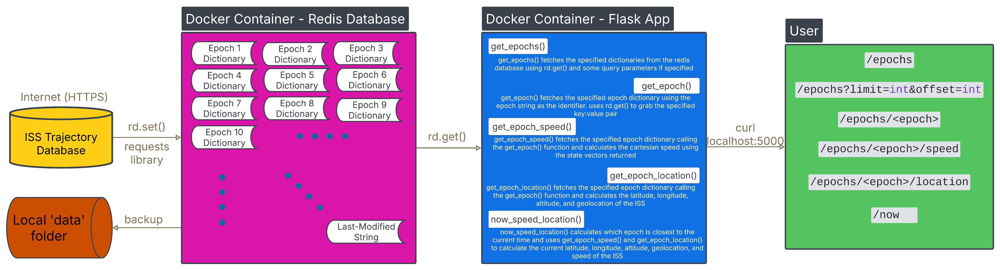

# Homework 5: Containerized Flask App - ISS Data Retrieval & Speed Calculator Routes

## Table of Contents
1. [Description](README.md#description)
2. [Software Diagram](README.md#software-diagram)
2. [ISS Trajectory Data Set](README.md#iss-trajectory-data-set)
2. [Getting Started](README.md#getting-started)
3. [Building the Container](README.md#building-the-container)
4. [Running Docker Container](README.md#running-containerized-scripts)
5. [Clean Up](README.md#clean-up)
6. [Alternative: Using Docker Compose](README.md#alternative-using-docker-compose)
9. [Resources](README.md#resources)
10. [AI Usage](README.md#ai-usage)

## Description

This code features five routes in a containerized flask app. They are able to injest the [ISS Trajectory Data](https://spotthestation.nasa.gov/trajectory_data.cfm) and store it in a list of dictionaries. You are able to return a modified list of epochs by using query parameters as well as return a specific epoch and its speed. There exists a final route which can return the epoch closest to the current time and its instantaneous speed. 

The iss_tracker script contains three functions of the names: 
* now_epoch - Identifies which epoch is closest to the current time. This will change based on when you run the script. 
* speed_calc - Calculates the instantaneous speed closest to the current time and the average speed over the data set.  
* range_of_data - Prints the 2 epochs that comprise the range of dates from which the data was collected. 

As well as 5 routes of the form of: 

|  Route                        |  Method  | Functionality                                                                      |
| ----------------------------- | -------- | ---------------------------------------------------------------------------------- |
| /epochs                       | GET      | Return entire data set                                                             |
| /epochs/?limit=int&offset=int | GET      | Return modified list of Epochs given query parameters                              | 
| /epochs/<epoch>               | GET      | Return state vectors for a specific Epoch from the data set                        | 
| /epochs/<epoch>/speed         | GET      | Return instantaneous speed for a specific Epoch in the data set                    | 
| /now                          | GET      | Return state vectors and instantaneous speed for the Epoch that is nearest in time | 

This project illustrates how to ingest data from a Web API using the ```requests``` library. It also helps facilitate the analysis of such data by using the three functions and five routes mentioned above. 

This code is necessary when you want to constantly have the updated data to your disposal for analysis. It facilitates running some calculations on the most up to date data. 

## Software Diagram


This diagram shows the typical flow of data focused around the files of homework05. We can clearly see that the docker container pulls data from the NASA's ISS Trajectory Database using the requests library. The iss_tracker.py inside the docker container converts the xml response from the database into a json like list of dictionaries that we can analyze, illustrated by the data block. This is done outside any routes for a faster runtime. The get_data() function uses this variable called "data" to return that same data depending the query parameters. The function get_epoch() also uses this retrieved data to look for a specific epoch and returns the epoch and its state vectors as a dictionary. The get_epoch_speed() function uses the retrieved state vectors of a specified epoch to calculate the cartesian speed of that epoch. Finally, the now_speed() uses the previously defined now_epoch() and the get_epoch_speed() function to calculate the instantaneous speed of the nearest epoch to the current time. 

The user is able to interact with the containerised flask application using the ```curl``` command. Running the illustrated routes using the ```curl localhost:5000``` and proper query parameters, it allows the user to call each each containerized function and analyze the ISS Trajectory Data. 

## ISS Trajectory Data Set 
The [ISS Trajectory Data](https://spotthestation.nasa.gov/trajectory_data.cfm) provides the most current posted ephemeris available in .txt and .xml file format. Each file contains header lines with the ISS mass in kg, drag area in m2, and drag coefficient used in generating the ephemeris. The header also contains lines with details for the first and last ascending nodes within the ephemeris span. Following this is a listing of upcoming ISS translation maneuvers, called “reboosts,” and visiting vehicle launches, arrivals, and departures. 

After the header, ISS state vectors in the Mean of J2000 (J2K) reference frame are listed at four-minute intervals spanning a total length of 15 days. During reboosts (translation maneuvers), the state vectors are reported in two-second intervals. Each state vector lists the time in UTC; position X, Y, and Z in km; and velocity X, Y, and Z in km/s.

For more information please follow this link: https://spotthestation.nasa.gov/trajectory_data.cfm. 

Disclaimer: The following description represents the same description from NASA's website. 

## Getting Started
Check which directory you are currently on by running
``` bash
pwd
```

You should see you are in homework05 such as: 
``` bash
/home/guarneros/coe332-hw-guarneros/homework05
```
If not change to homework05 folder by: 
``` bash
cd homework05/
```

## Building the Container

To build the image from the provided Dockerfile run: 
``` bash
docker build -t username/flask-iss_tracker:1.0 .

# Example
docker build -t rguarneros065/flask-iss_tracker:1.0 .
```
Make sure to replace 'username' with your Docker Hub username. 

To ensure you see a copy of your image that was built, run 
``` bash 
docker images

# Output
REPOSITORY                        TAG       IMAGE ID       CREATED        SIZE
rguarneros065/flask-iss_tracker   1.0       8b76d04e33e3   21 hours ago   1.04GB
...

``` 

## Running Docker Container
To run your docker container: 

``` bash
docker run --name "flask-iss_tracker" -d -p 5000:5000 username/flask-iss_tracker:1.0

# Example
docker run --name "flask-iss_tracker" -d -p 5000:5000 rguarneros065/flask-iss_tracker:1.0

```
#### Note
If port is unavailable try using another port such as follows: 
``` bash
docker run --name "flask-iss_tracker" -d -p 5001:5000 rguarneros065/flask-iss_tracker:1.0 
```

Make sure the container is up and running with 
```bash
docker ps -a

# Output
CONTAINER ID   IMAGE                                 COMMAND                  CREATED         STATUS                   PORTS                                       NAMES
c05196952c5c   rguarneros065/flask-iss_tracker:1.0   "python iss_tracker.…"   5 seconds ago   Up 4 seconds             0.0.0.0:5000->5000/tcp, :::5000->5000/tcp   flask-iss_tracker
...

```
Your container list should have a container with the name you gave it, an Up status, and the port mapping you specified. 
Note: Make sure to pay attention to the Container ID since this will be needed when cleaning up after accessing your microservice. 

## Accessing Microservice
Now you are ready to run your Flask microservice! 

### Running '/epochs' route 
To return the entire data set you can run: 
``` bash
curl "localhost:5000/epochs"

# Output
[
  {
    "EPOCH": "2025-052T12:00:00.000Z",
    "X": {
      "#text": "-1627.01220187592",
      "@units": "km"
    },
    "X_DOT": {
      "#text": "-7.1308965092829402",
      "@units": "km/s"
    },
    "Y": {
      "#text": "4599.2962205130698",
      "@units": "km"
    },
    "Y_DOT": {
      "#text": "0.32375775761575998",
      "@units": "km/s"
    },
    "Z": {
      "#text": "-4733.4531236806697",
      "@units": "km"
    },
    "Z_DOT": {
      "#text": "2.7667916377209498",
      "@units": "km/s"
    }
  }
]
...

```
The following command returned a list of dictionaries containing the EPOCH, X, Y, Z, X_DOT, Y_DOT, and Z_DOT values for each. 

Note: This command might take a while since it is trying to fetch the ISS data from the [NASA Website](https://spotthestation.nasa.gov/trajectory_data.cfm). 

### Running '/epochs/?limit=int&offset=int' route 
You can also return a certain number of epochs with a certain offset. This is done using query parameters as follows: 
```bash
curl "localhost:5000/epochs?limit=int&offset=int"

# Example
curl "localhost:5000/epochs?limit=1&offset=4"

# Output
[
  {
    "EPOCH": "2025-052T12:16:00.000Z",
    "X": {
      "#text": "-6351.9707892400202",
      "@units": "km"
    },
    "X_DOT": {
      "#text": "-1.7301970697409399",
      "@units": "km/s"
    },
    "Y": {
      "#text": "2416.67730860454",
      "@units": "km"
    },
    "Y_DOT": {
      "#text": "-4.4220746956527099",
      "@units": "km/s"
    },
    "Z": {
      "#text": "-53.224668333840903",
      "@units": "km"
    },
    "Z_DOT": {
      "#text": "6.0135920755168097",
      "@units": "km/s"
    }
  }
]
```
The following command returned the specified number of epoch(s), in this case 1, starting at the fifth epoch as specified by an offset value of 4. 

If you leave offset empty, it will default to zero offset. Note that if you run: 
```bash 
curl "localhost:5000/epochs?limit=5404&offset=0"
```
OR
```bash
curl "localhost:5000/epochs?limit=5404"
```
The entire data set will be returned. 

### Running '/epochs/<epoch>' route 
You are also able to return a specific epoch using the following route: 
``` bash
curl "localhost:5000/epochs/<epoch>"

# Example
curl "localhost:5000/epochs/2025-052T12:16:00.000Z"

# Output
{
  "EPOCH": "2025-052T12:16:00.000Z",
  "X": {
    "#text": "-6351.9707892400202",
    "@units": "km"
  },
  "X_DOT": {
    "#text": "-1.7301970697409399",
    "@units": "km/s"
  },
  "Y": {
    "#text": "2416.67730860454",
    "@units": "km"
  },
  "Y_DOT": {
    "#text": "-4.4220746956527099",
    "@units": "km/s"
  },
  "Z": {
    "#text": "-53.224668333840903",
    "@units": "km"
  },
  "Z_DOT": {
    "#text": "6.0135920755168097",
    "@units": "km/s"
  }
}
```
This command only returned the specified dictionary with that certain epoch value. 

### Running '/epochs/<epoch>/speed' route 
If you want to calculate the speed of a specific epoch, you are able to do so with the following command:
```bash
curl "localhost:5000/epochs/<epoch>/speed"

# Example
curl "localhost:5000/epochs/2025-052T12:16:00.000Z/speed"

# Output
7.662350563945161 km/s 
```
As seen above, this route calculates the speed of the specified epoch using the square root of the sum of squares of its cartesian components. 

### Running '/now' route 
Another functionality of the application is returning the state vectors and instantaneous speed for the Epoch that is nearest in time. 
This is available with the following route:
```bash
curl "localhost:5000/now"

# Output
[
  {
    "EPOCH": "2025-056T06:16:00.000Z",
    "X": {
      "#text": "-5465.7288865307401",
      "@units": "km"
    },
    "X_DOT": {
      "#text": "2.5260773392678",
      "@units": "km/s"
    },
    "Y": {
      "#text": "345.05143617714498",
      "@units": "km"
    },
    "Y_DOT": {
      "#text": "-6.0587909595984204",
      "@units": "km/s"
    },
    "Z": {
      "#text": "4018.0134588993701",
      "@units": "km"
    },
    "Z_DOT": {
      "#text": "3.9529796013482801",
      "@units": "km/s"
    },
    "instant speed": "7.662640690046052",
    "units": "km/s"
  }
]
```
As mentioned above, this route returned the state vectors and instantaneous speed of the epoch closest to the current time. 

## Clean Up 
Don't forget to stop your running container and remove it. 
First of all, run 
```bash 
docker ps -a

# Output
CONTAINER ID   IMAGE                                 COMMAND                  CREATED         STATUS                   PORTS                                       NAMES
c05196952c5c   rguarneros065/flask-iss_tracker:1.0   "python iss_tracker.…"   5 seconds ago   Up 4 seconds             0.0.0.0:5000->5000/tcp, :::5000->5000/tcp   flask-iss_tracker
...

```

Stop the container and remove it using the following commands: 
``` bash
docker stop CONTAINER_ID 

docker rm CONTAINER_ID

# Example
docker stop c05196952c5c 

docker rm c05196952c5c 
```

You can double check that you successfully exited and removed the running container by running ```docker ps -a```. You should see that the flask-iss_tracker is gone. 

## Alternative: Using Docker Compose 
As you may have noticed, the terminal commands we are running are becoming tedious and long. This may lead to errors, especially when typing each command by hand. To avoid issues like this, it is a good idea to create a docker compose file and running it the container with this. Below, I will show you how to run this. 

### Running Docker Compose
Before using the  ```docker compose up``` verb, we have to make some small changes to our docker-compose.yml file. First, let's make sure that we don't have any container using port 5000 by running: 
```bash
docker ps -a

# NO CONTAINERS LISTENING TO PORT 5000 EXAMPLE
CONTAINER ID   IMAGE         COMMAND    CREATED       STATUS                   PORTS     NAMES
25b7cab180e7   hello-world   "/hello"   2 weeks ago   Exited (0) 2 weeks ago             youthful_mcnulty
...
```
Under the PORTS section, no containers should be listening in to port 5000. Now we can proceed to configuring our docker-compose.yml file. 
As you may have noticed, you have a [docker-compose.template](docker-compose.template) file. You will have to modify this to be able to run docker compose. 
```bash
cp docker-compose.template docker-compose.yml
ls
# Output 
Dockerfile  README.md  diagram.png  docker-compose.template  docker-compose.yml  iss_tracker.py  requirements.txt  test_iss_tracker.py
```
A docker-compose.yml file should have been created. Now you are able to edit this. 

Using your favorite text editor (i.e vim, emacs, nano, etc), open this file and change 'username' to your docker username. 
```bash
# Example
vim docker-compose.yml 

# Output
--
version: "3"

services:
    flask-app:
        build:
            context: ./
            dockerfile: ./Dockerfile
        image: username/flask-iss_tracker:1.0
        container_name: flask-iss_tracker-app
        ports:
            - "5000:5000"
...
```
Please make sure to change 'username' to your actual docker username. 

Now you are ready to run docker compose. 
```bash 
docker compose up -d
```
The -d flag allows you to start the service in the background. 

Make sure the container is up and running using the ```docker ps -a``` command. 

### Accessing Container's Shell
To go into the container's shell run: 
```bash
docker exec -it flask-iss_tracker-app bash

# Example Output
root@418dbdb69c99:/app# 
```
Now you are inside the container's environment. You are able to run the curl commands as discussed in the [Accessing Microservice](README.md#accessing-microservice) section. Please refer to this sections for further details. 

In addition to running the curl commands, you also able to run pytest. You should have been initialized into the ```/app``` folder. If you run ```ls``` you should see the iss_tracker and test scripts. To run the pytests you can do the following: 
```bash
pytest

# Example Output
========================================================================== test session starts ==========================================================================
platform linux -- Python 3.12.9, pytest-8.3.4, pluggy-1.5.0
rootdir: /app
collected 10 items                                                                                                                                                      

test_iss_tracker.py ..........                                                                                                                                    [100%]

========================================================================== 10 passed in 7.77s ===========================================================================
```

You have successfully ran all the scripts in this folder. Make sure to clean up after you are done by running: 
```bash 
exit
```
This will bring you back to your system's environment. To stop and remove the container run: 
```bash
docker compose down

# Example Output
WARN[0000] /home/ubuntu/coe332-hw-guarneros/homework05/docker-compose.yml: `version` is obsolete 
[+] Running 2/2
 ✔ Container flask-iss_tracker-app  Removed                                                                                                                         0.4s 
 ✔ Network homework05_default       Removed                                                                                                                         0.1s
```
You can double-check that it in fact removed your running container by running ```docker ps -a```. 


## Resources 

* Logging Documentation: https://docs.python.org/3/howto/logging.html
* Requests Library: https://pypi.org/project/requests/ 
* Finding Average of List: https://www.geeksforgeeks.org/find-average-list-python/ 
* pow() Function: https://www.w3schools.com/python/ref_math_pow.asp 
* ISS Trajectory Data: https://spotthestation.nasa.gov/trajectory_data.cfm 
* COE 332 Spring 2025 Docs: https://coe-332-sp25.readthedocs.io/en/latest/ 
* Table Syntax for README: https://docs.github.com/en/get-started/writing-on-github/working-with-advanced-formatting/organizing-information-with-tables 

## AI Usage
AI (ChatGPT) was mainly used for debugging the code. Sometimes, my syntax would be wrong and I used AI to help me identify it. Most of the built-in functions used in the scripts were found by reading the documentation cited in [Resources](README#resources). 

ChatGPT was also used for creating some test cases for the iss_tracker.py script. Every section generated by AI is commented appropriately. 

ChatGPT was used to make my code more robust since I wanted it to 'spit' out a 404 error code when given a wrong epoch. Since this was not explicitly mentioned in the class documentation, I asked ChatGPT how it would implement this into my code. The sections where AI was used are commented appropriately in the code. 
